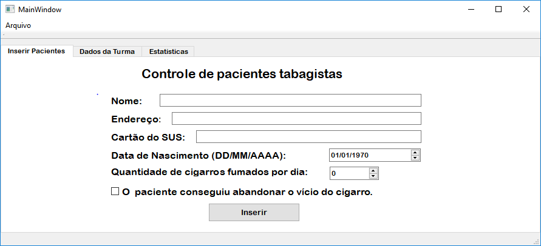
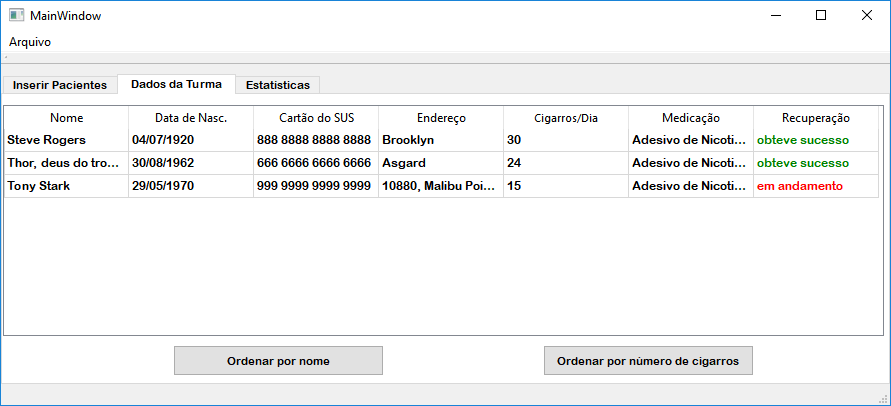
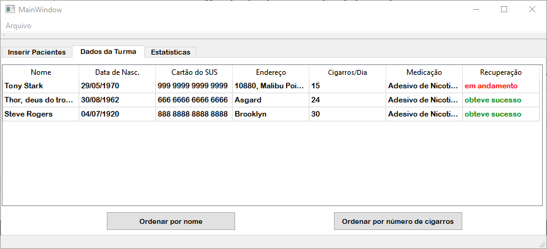
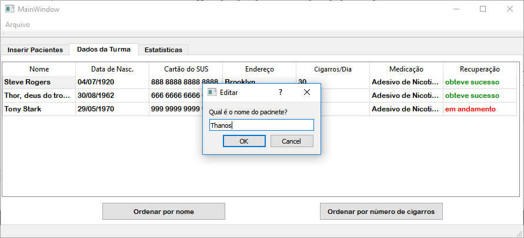
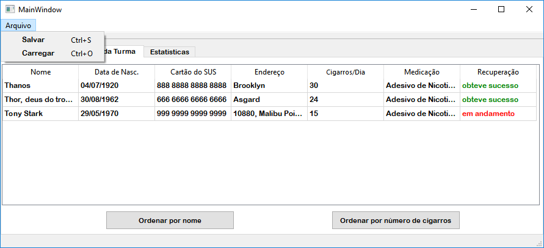

# Controle-de-Pacientes-Tabagistas
O Controle de Pacientes Tabagistas tem como objetivo tornar mais prático o cadastro dos dados de pacientes tabagistas em turmas para tratamento feito pelos enfermeiros das UBS. Esse tratamento é realizado durante quatro semanas e é realizada uma sessão por semana. Após as sessões, é feito o cadastro dos pacientes para controle da prefeitura. 
A figura abaixo mostra a tela principal da aplicação:

A aplicação também conta com uma aba para mostrar a tabela de pacientes cadastrados na turma,

E uma aba para mostrar as estatísticas da turma, na qual é possível visualizar o total de pacientes cadastrados na turma, a média de cigarros fumados por dia pela turma e quantos dos pacientes abandonaram o vício.

## Como inserir um paciente na turma e organizar a tabela

Para cadastrar um paciente, basta informar seu nome, endereço, número do cartão do SUS, data de nascimento e quantos cigarros fuma durante o dia. Além disso, caso o tratamento tenha obtido êxito e o paciente tenha abandonado o vício, basta clicar no check Box. Por fim, clicar no botão "Inserir".

Após feito isso, o paciente será inserido na turma e apresentado na tabela. Existem dois botões na aba da tabela, um que permite organizar a turma por meio do nome e outro por meio da quantidade de cigarros fumados, basta clicar em qualquer um de sua preferência. A figura abaixo mostra a tabela organizada pelo nome.

A figura abaixo mostra a tabela organizada pelo número de cigarros fumados por cada paciente.

## Como modificar um dado de paciente na tabela

Para mudar algum dado na tabela, basta clicar duas vezes no dado que deseja alterar e o programa abrirá uma janela onde será possivel inserir o novo dado. Após isso, clique no botão "Ok" e dado será alterado. A figura abaixo mostra a janela onde é possível alterar o nome.

## Como salvar ou abrir um arquivo

Para abrir ou salvar um arquivo, basta clicar em Arquivo e logo após escolher entre salvar ou carregar o arquivo, logo após abrirá uma janela na qual é possível selecionar uma pasta para salvar o arquivo ou um arquivo para abrir. A figura abaixo mostra as opções "salvar" e "carregar".

