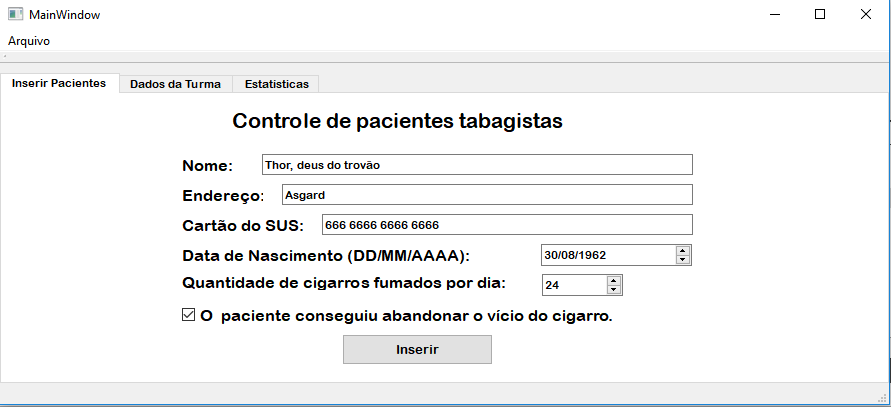
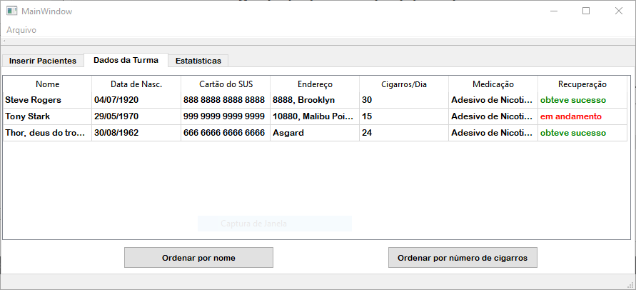
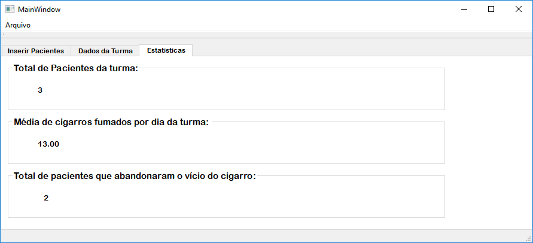

# Controle-de-Pacientes-Tabagistas
O Controle de Pacientes Tabagistas tem como objetivo tornar mais prático o cadastro dos dados de pacientes tabagistas em turmas para tratamento feito pelos enfermeiros das UBS. Esse tratamento é realizado durante quatro semanas e é realizada uma sessão por semana. Após as sessões, é feito o cadastro dos pacientes para controle da prefeitura. 
A figura abaixo mostra a tela principal da aplicação:

A aplicação também conta com uma aba para mostrar a tabela de pacientes cadastrados na turma,

E uma aba para mostrar as estatísticas da turma, na qual é possível visualizar o total de pacientes cadastrados na turma, a média de cigarros fumados por dia pela turma e quantos dos pacientes abandonaram o vício.

#Como inserir um paciente na turma

Para cadastrar um paciente, basta informar seu nome, endereço, número do cartão do SUS, data de nascimento e quantos cigarros fuma durante o dia. Além disso, caso o tratamento tenha obtido êxito e o paciente tenha abandonado o vício, basta clicar no check Box.

